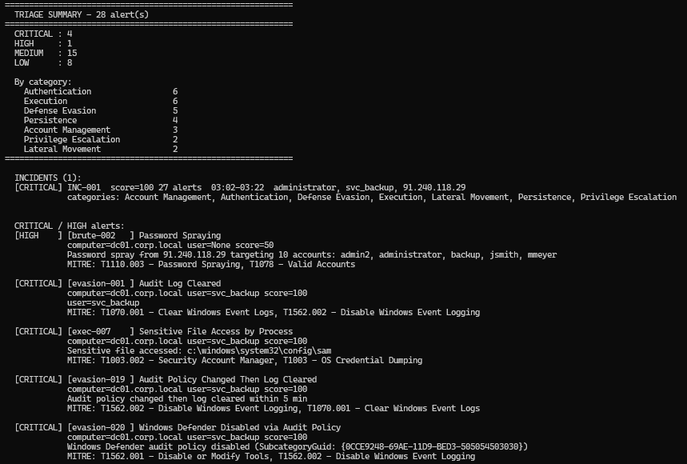
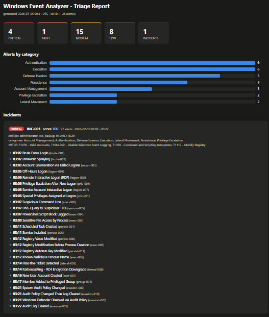

# Windows Event Analyzer

[](https://github.com/Pingu314/windows_event_analyzer/actions/workflows/ci.yml)


A detection and triage tool that hunts for attack patterns in Windows event
logs. It parses EVTX, CSV and JSONL exports (Security, **Sysmon**, **Defender**
and System channels) or reads the **live event log**, runs **107 built-in
SIGMA-style rules** plus your own **Sigma YAML rules**, scores every alert
0–100, enriches it with threat intelligence and asset context, maps it to
**MITRE ATT&CK**, and **correlates related alerts into incidents** - from raw
log to prioritised case list in one command.

Same craft as fraud monitoring in the card business: ingest a stream of
events, separate signal from noise, cluster related activity into one case,
score the risk and triage what matters first. I spent two years doing exactly
this kind of triage in 24/7 fraud detection at a Swiss payment services
provider - this project rebuilds the craft on Windows logs. Part of a
detection engineering portfolio.



---

## Sample output

Running the bundled attack-chain sample - 28 events spanning password spray,
account enumeration, service-account RDP, privilege escalation, credential
dumping, triple persistence, Kerberoasting and log clearing - the correlator
folds all of it into **one case**:

```
============================================================
  TRIAGE SUMMARY - 28 alert(s)
============================================================
  CRITICAL : 4
  HIGH     : 1
  MEDIUM   : 15
  LOW      : 8

  By category:
    Authentication                 6
    Execution                      6
    Defense Evasion                5
    Persistence                    4
    Account Management             3
    Privilege Escalation           2
    Lateral Movement               2
============================================================

  INCIDENTS (1):
  [CRITICAL] INC-001  score=100 27 alerts  03:02-03:22  administrator, svc_backup, 91.240.118.29
             categories: Account Management, Authentication, Defense Evasion,
                         Execution, Lateral Movement, Persistence, Privilege Escalation

  CRITICAL / HIGH alerts:
  [CRITICAL] [evasion-001 ] Audit Log Cleared
             computer=dc01.corp.local user=svc_backup score=100
             MITRE: T1070.001 - Clear Windows Event Logs, T1562.002 - Disable Windows Event Logging

  [CRITICAL] [exec-007    ] Sensitive File Access by Process
             computer=dc01.corp.local user=svc_backup score=100
             Sensitive file accessed: c:\windows\system32\config\sam
             MITRE: T1003.002 - Security Account Manager, T1003 - OS Credential Dumping
```

An HTML report with severity tiles and per-incident timelines is written with
`--html`:



## Quick start

```bash
git clone https://github.com/Pingu314/windows_event_analyzer.git
cd windows_event_analyzer
pip install -e .

# analyze the bundled sample logs
evtx-analyze data/sample_logs/security.csv
evtx-analyze data/sample_logs/sample_attack_chain.json   # full intrusion chain

# analyze your own logs - files, directories, mixed formats
evtx-analyze security.evtx
evtx-analyze C:\logs\ --recursive
evtx-analyze dc01.evtx fileserver.csv sentinel_export.json

# read the local event log directly (Windows, elevated shell)
evtx-analyze --live
evtx-analyze --live --live-channel System --live-max 5000

# focus and report
evtx-analyze security.evtx --min-severity HIGH --html
```

Multiple inputs are merged into one timeline before detection, so
**cross-file correlation** works: a brute force that starts in one log and the
lateral movement it enables in another are both caught.

## Pipeline

```
 parse ──► detect ──► score ──► enrich ──► map MITRE ──► correlate ──► report
 (EVTX/CSV/  (107 rules  (0-100,    (ipinfo,     (ATT&CK      (alerts →     (console,
  JSONL/      + Sigma     CRITICAL   AbuseIPDB,   techniques)   incidents)    JSON, CSV,
  live log)   YAML)       auto-      VT, GreyNoise,                           HTML,
                          escalation) user/host ctx)                          REST API)
```

| Stage | Module | What it does |
|---|---|---|
| Parse | `src/parser.py` | Normalises EVTX, Event Viewer CSV and JSONL (Security, Sysmon, Defender, System channels) into one event schema; `--live` reads the local log via wevtutil. Handles locale date formats, UTF-8 BOM, field-name aliases. |
| Detect | `src/detector.py` | 107 built-in rules: threshold rules (brute force, spray, mass lockout), sequence rules (logon→privilege, policy-change→log-clear), channel rules (Sysmon, Defender, System) and single-event rules. Non-overlapping window clustering - one burst = one alert. Allowlist suppression for known-good IPs/users/hosts. |
| Sigma | `src/sigma_loader.py` | Loads Sigma YAML rules (EventID + field filters subset) at runtime - bundled rules in `rules/sigma/`, or point `--sigma-rules` at your own directory. |
| Score | `src/risk_scorer.py` | Weighted 0–100 risk score with severity tiers. Critical events (log cleared, DSRM password, SID history…) auto-escalate to 100. Sigma rules scored by their level. |
| Enrich | `src/enricher.py` | IP geolocation/Tor/ASN (ipinfo.io), IP reputation (AbuseIPDB), vendor verdicts (VirusTotal), scanner/noise classification (GreyNoise), account classification (service/machine/privileged), host classification (DC/server/workstation), LOLBin + path anomaly, sensitive privileges. All API enrichers degrade gracefully without tokens. |
| Map | `src/mitre_mapper.py` | Primary technique per rule plus contextual techniques from alert features. |
| Correlate | `src/correlator.py` | Groups alerts sharing an actor entity (source IP, user) within a time window into incidents - the fraud-case-clustering model applied to logs. Incident severity/score aggregate the member alerts plus a kill-chain-breadth bonus. |
| Report | `src/report_generator.py`, `src/dashboard.py` | Console triage summary with incident list, timestamped JSON/CSV/HTML reports, Flask REST API. |

## Detection coverage

| Category | Rules | Examples |
|---|---|---|
| Defense Evasion | 26 | Audit log cleared, firewall tampering, Defender malware/RTP-off/config-tamper, security service disabled or crashed, process tampering, CrashOnAuditFail |
| Account Management | 19 | Privileged group changes, SID history injection, DSRM password, account enumeration |
| Persistence | 15 | Scheduled tasks, service installs from user-writable paths, autorun keys (Security + Sysmon), startup-folder drops, WMI subscriptions, SSP load |
| Authentication | 13 | Brute force, password spraying, off-hours logon, RDP anomalies, mass lockout |
| Execution | 12 | Suspicious parent-child (Office→shell), encoded PowerShell, LOLBins, SAM/NTDS access, LSASS memory access, remote thread injection, C2-port connections, suspicious-TLD DNS |
| Lateral Movement | 10 | Pass-the-ticket, Kerberoasting (RC4 downgrade), NTLM relay-to-self, SMB enumeration |
| Privilege Escalation | 7 | Logon→special-privilege sequences, token/user-right manipulation |
| Active Directory | 5 | AD object create/modify/delete/move (DC-only, auto-skipped elsewhere) |

Sysmon, Defender and System channel rules are channel-gated: they only fire
on events from their own log, so low Sysmon event IDs can never collide with
Security events. Rules that depend on optional audit policies (process
creation 4688, PowerShell ScriptBlock 4104, object access 4663) activate
automatically when those events are present; a caveat is logged when they
are not. DC-only events never fire false alerts on member servers.

### Bring your own Sigma rules

```bash
evtx-analyze security.evtx --sigma-rules C:\rules\my_sigma\
evtx-analyze security.evtx --no-sigma        # built-in rules only
```

Three starter rules ship in [`rules/sigma/`](rules/sigma/). The loader
supports the common "EventID + field filters" Sigma shape (`|contains`,
exact match, single `selection` condition); unsupported rules are skipped
with a warning, never fatal. Alerts from Sigma rules are scored by their
`level` and correlate into incidents like any built-in rule.

## REST API

```bash
python -m src.dashboard          # http://127.0.0.1:5000
```

| Endpoint | Description |
|---|---|
| `GET /alerts` | Cached alerts from sample data (`limit`/`offset` pagination) |
| `GET /alerts/summary` | Severity, category and top-rule breakdown |
| `GET /alerts/severity/<level>` | Filter by CRITICAL/HIGH/MEDIUM/LOW |
| `GET /alerts/<rule_id>` | Filter by rule, e.g. `brute-001` |
| `GET /incidents` | Correlated incidents from the cached alerts |
| `POST /analyze` | Upload one or more log files (multipart), returns alerts |
| `DELETE /cache` | Reset the sample-data cache |

```bash
curl -F "file=@security.csv" "http://127.0.0.1:5000/analyze?brute_threshold=3"
```

## Configuration

Every tunable lives in [`config/settings.py`](config/settings.py) - detection
thresholds, scoring weights, suspicious process/cmdline lists, privileged
groups, naming conventions, high-risk countries. No hardcoded values in the
pipeline modules.

Threat-intel enrichment is optional. Copy `.env.example` to `.env` and add
free-tier tokens:

```
IPINFO_TOKEN=...          # ipinfo.io  - 50k lookups/month free
ABUSEIPDB_TOKEN=...       # AbuseIPDB  - 1k checks/day free
VIRUSTOTAL_TOKEN=...      # VirusTotal - 500 lookups/day free
GREYNOISE_COMMUNITY=true  # GreyNoise  - keyless community mode (10 IPs/day)
GREYNOISE_TOKEN=...       # ...or an API key, if your plan includes one
```

Each token unlocks one enricher; any subset (including none) works -
enrichers without a token are skipped, and no alert IPs are ever sent to a
service you did not opt into. GreyNoise is the SOC noise-filter: it tells
internet-wide scanner background noise apart from targeted attacks against
*your* network.

Known-good sources (vulnerability scanners, backup accounts, jump hosts) can
be suppressed via `ALLOWLIST_IPS` / `ALLOWLIST_USERS` / `ALLOWLIST_COMPUTERS`
in settings - suppressions are logged so tuning stays auditable.

Thresholds can also be overridden per run:

```bash
evtx-analyze security.csv --brute-threshold 3 --brute-window 10 --spray-threshold 5
```

## Tuning & false positives

Detection is a trade-off between coverage and noise. Design choices made here:

- **One burst, one alert** - threshold rules use non-overlapping window
  clustering, so a 500-attempt brute force produces one alert with
  `count=500`, not hundreds of alerts.
- **Severity does the triage** - informational rules (RDP disconnects,
  privileged service calls) score LOW and stay out of the CRITICAL/HIGH
  console detail; they are still in the JSON export for hunting.
- **Context-gated rules** - group changes only alert on *privileged* groups;
  service installs only get escalated detail from user-writable paths; NTLM
  logons only alert on the relay-to-self pattern, not every NTLM auth.
- **Incidents over alerts** - the correlator folds related alerts into one
  case per actor, so an analyst triages a handful of incidents instead of
  paging through dozens of alerts.
- **Allowlist with an audit trail** - known-good sources are suppressed at
  detection time, and every suppression is logged.
- **Environment-specific lists** - service-account patterns, business hours,
  host naming conventions and the user watchlist in `settings.py` should be
  adapted to your environment before judging alert quality.

## Testing

```bash
pip install -e ".[dev]"
pytest            # 358 tests, coverage gate 95% (currently ~98%)
```

CI runs ruff + flake8 + the test matrix on Python 3.10–3.14.

## Antivirus False Positives


This project's test fixtures and sample logs intentionally contain benign
strings that mimic real attacker indicators - e.g. `procdump.exe` accessing
`lsass.exe`, `HackTool:Win64/Mikatz`, and encoded PowerShell command
lines. These are **test data only**, used to validate the detection
rules; they contain no actual malicious code.

Because the strings resemble real threat indicators, some antivirus
engines (including Microsoft Defender) may flag `tests/test_detector.py`
or `data/sample_logs/` as a `HackTool`/`DumpLsass`-type detection.
**This is expected and safe.**

If your AV quarantines a test file:
- Restore it from quarantine, and
- Add this repository's folder to your AV exclusions before running
  the test suite.

No credentials are dumped and no LSASS access is performed - the tests
only feed synthetic event dictionaries into the rule engine.

## Docker

```bash
docker build -t evtx-analyze .
docker run --rm -v C:\logs:/logs evtx-analyze /logs/security.csv
```

## Limitations

Honest scope notes - this is a triage/portfolio tool, not a SIEM:

- `--live` reads a snapshot of the local event log (newest N events); there
  is no continuous tailing or remote collection.
- The Sigma loader covers the "EventID + field filters" rule shape, not the
  full Sigma spec (no aggregations, no multi-selection conditions).
- Business-hours logic compares against UTC timestamps; adjust
  `BUSINESS_HOURS_*` in settings to your organisation's UTC offset.
- Ambiguous CSV dates (`01/02/2024`) are parsed US-first (`%m/%d/%Y`).
- The Flask dashboard has no authentication or rate limiting - local use only.
- Detection rules are heuristics tuned for lab datasets; production use
  requires environment-specific tuning (see above).

## Portfolio context

| # | Project | Description |
|---|---------|-------------|
| P1 | [soc_threat_analyzer](https://github.com/Pingu314/soc_threat_analyzer) | Log-based threat detection - brute force, password spraying, impossible travel |
| P2 | [phishing_url_analyzer](https://github.com/Pingu314/phishing_url_analyzer) | Phishing URL analysis pipeline with threat-intel enrichment |
| P3 | [email_header_analyzer](https://github.com/Pingu314/email_header_analyzer) | Email header analysis - SPF/DKIM/DMARC, routing, MIME evasion |
| P4 | **windows_event_analyzer** | This project - Windows event log triage: 107 rules + Sigma, incident correlation, MITRE mapping |

## License

MIT - see [LICENSE](LICENSE).